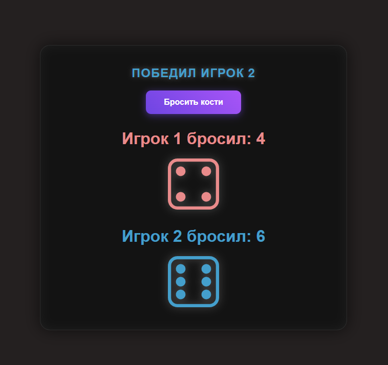

# Игра в кости (Dice Game)

Простой проект на **HTML, CSS и JavaScript**, в котором два игрока бросают кости.  
Результат определяется случайным образом, и игра показывает, кто победил или была ли ничья.

---

## Функционал

- Два игрока бросают кубики одновременно.
- Выпадает случайное число от 1 до 6 для каждого игрока.
- На экране отображаются:
  - число, выпавшее каждому игроку,
  - изображение соответствующего кубика,
  - результат игры (победитель или ничья).
- Кнопка **"Бросить кости"** запускает новый раунд.

---

## Демо проекта

Демо проекта доступно по ссылке:

---
