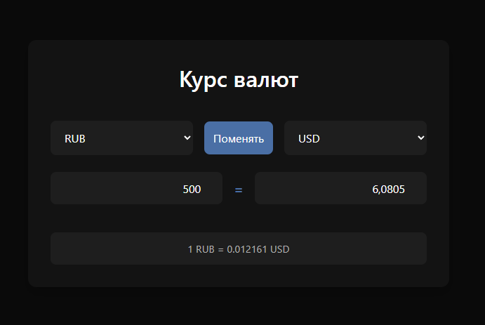

# Приложение "Курс валют"

Простое веб-приложение на **HTML, CSS и JavaScript** для конвертации валют в реальном времени.  
Использует [Exchange Rate API](https://www.exchangerate-api.com) для получения актуальных курсов валют.

---

## Функционал

- Получение текущих курсов валют через API.
- Выбор двух валют для сравнения.
- Автоматический пересчет суммы при вводе значения в одно из полей.
- Кнопка **«Поменять»** для быстрого обмена валют местами.
- Отображение актуальной информации в формате:  
  `100 RUB = 1 USD`

---

## Демо проекта

Демо проекта доступно по ссылке: https://jacio1.github.io/javascript-projects/exchangeRateApp/

---
