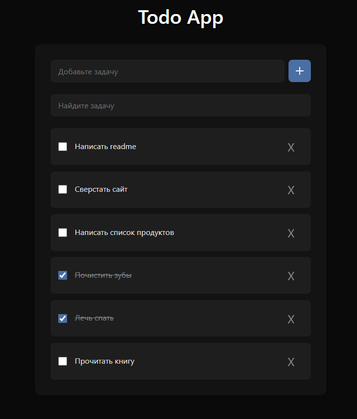

# Мини-проекты на JavaScript

В этом репозитории собраны мои небольшие проекты на **JavaScript**, **HTML** и **CSS**, созданные для изучения фронтенд-разработки и практики работы с DOM, API и объектно-ориентированным программированием.

---

## Содержание проектов

| Проект                  | Краткое описание                                                                                                          | Скриншот                                                    |
| ----------------------- | ------------------------------------------------------------------------------------------------------------------------- | ----------------------------------------------------------- |
| **Dice Game**           | Игра в кости для двух игроков с отображением результатов и победителя.                                                    |                |
| **Exchange Rate App**   | Конвертер валют с выбором валют и отображением актуального курса через API.                                               |     |
| **GitHub User Search**  | Поиск пользователей GitHub и просмотр их публичных репозиториев через GitHub API.                                         |           |
| **Image Slider**        | Слайдер изображений с кнопками «вперед/назад» и зацикливанием.                                                            |                     |
| **Todo App (ООП)**      | Список задач, реализованный через классы. Поддержка добавления, завершения и удаления задач с сохранением в LocalStorage. |              |
| **Todo App (Простой)**  | Классический Todo с поиском, отметкой выполненных задач, удалением и сохранением в LocalStorage.                          |                      |
| **User Management App** | CRUD-приложение для пользователей с созданием, редактированием и удалением через MockAPI.                                 |  |

---

## Демо проектов

- Демо проекта **Dice Game** доступно по ссылке: [https://jacio1.github.io/javascript-projects/diceGame/](https://jacio1.github.io/javascript-projects/diceGame/)
- Демо проекта **Exchange Rate App** доступно по ссылке: [https://jacio1.github.io/javascript-projects/exchangeRateApp/](https://jacio1.github.io/javascript-projects/exchangeRateApp/)
- Демо проекта **GitHub User Search** доступно по ссылке: [https://jacio1.github.io/javascript-projects/githubApp/](https://jacio1.github.io/javascript-projects/githubApp/)
- Демо проекта **Image Slider** доступно по ссылке: [https://jacio1.github.io/javascript-projects/slider/](https://jacio1.github.io/javascript-projects/slider/)
- Демо проекта **Todo App (ООП)** доступно по ссылке: [https://jacio1.github.io/javascript-projects/todoApp-OOP/](https://jacio1.github.io/javascript-projects/todoApp-OOP/)
- Демо проекта **Todo App** доступно по ссылке: [https://jacio1.github.io/javascript-projects/todoApp/](https://jacio1.github.io/javascript-projects/todoApp/)
- Демо проекта **User Management App** доступно по ссылке: [https://jacio1.github.io/javascript-projects/userManagmentApp/](https://jacio1.github.io/javascript-projects/userManagmentApp/)

---

## Общий функционал

- Работа с **DOM** (создание элементов, обработка событий, рендеринг).
- Использование **LocalStorage** для сохранения данных (для Todo приложений).
- Подключение внешних API:
  - Exchange Rate API
  - GitHub REST API
  - MockAPI
- Работа с **классами и ООП** (для Todo App).
- Плавные анимации (Image Slider) и интерактивные элементы.
