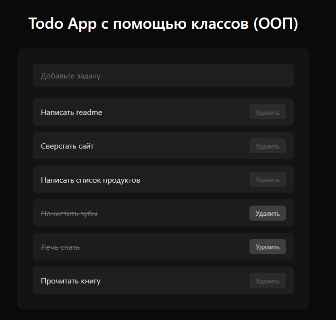

# Todo App (ООП)

Простое приложение для управления задачами, реализованное на **HTML, CSS и JavaScript** с использованием объектно-ориентированного подхода (ООП).  
Данные сохраняются в **LocalStorage**, поэтому список задач не пропадает после перезагрузки страницы.

---

## Функционал

- Добавление новой задачи (через поле ввода и клавишу Enter).
- Отметка задачи как выполненной (по клику).
- Удаление задачи (кнопка **«Удалить»**, доступна только после выполнения задачи).
- Сохранение задач в **LocalStorage**.
- Отображение выполненных задач со стилем (например, зачеркнутый текст).

---

## Архитектура (ООП)

Приложение разделено на классы:

- **LocalStorage** — работа с локальным хранилищем.
- **DOM** — утилиты для работы с DOM-элементами.
- **Item** — базовый класс для элементов.
- **TodoItem** — наследник `Item`, добавляет поле `completed`.
- **TodoApp** — основной класс приложения (логика, события, рендер).

---

## Интерфейс

Демо проекта доступно по ссылке: https://jacio1.github.io/javascript-projects/todoApp-OOP/

---
