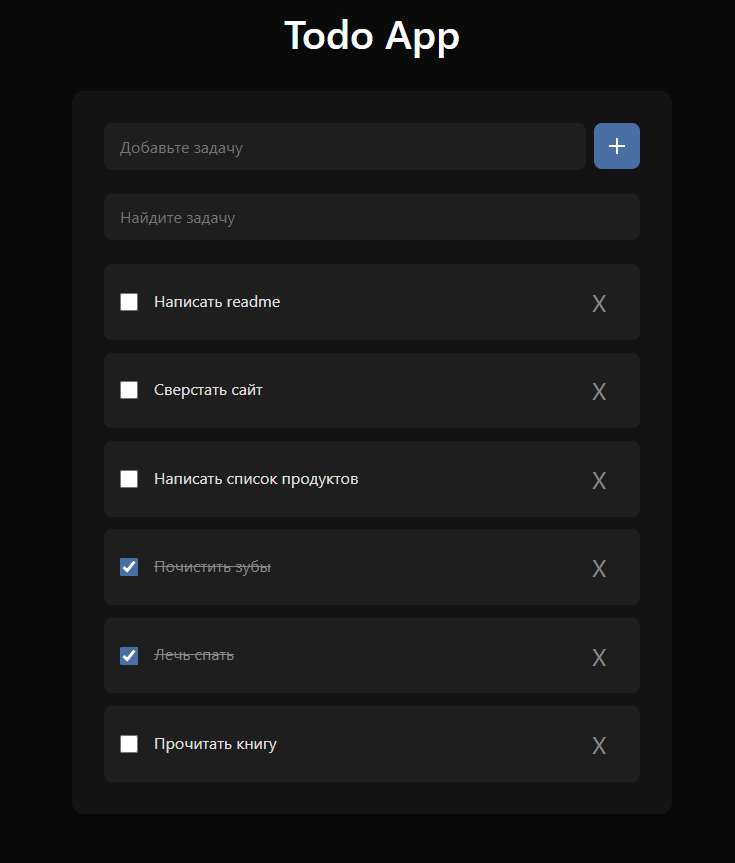

# Todo App

Простое веб-приложение на **HTML, CSS и JavaScript** для управления списком задач.  
Данные сохраняются в **LocalStorage**, поэтому список сохраняется даже после перезагрузки страницы.

---

## Функционал

- Добавление новых задач.
- Поиск по задачам (фильтрация списка).
- Отметка задач как выполненных (чекбокс).
- Удаление задач (доступно только для завершённых).
- Автоматическое сохранение в **LocalStorage**.

---

## Интерфейс

Демо проекта доступно по ссылке: https://jacio1.github.io/javascript-projects/todoApp/

---
